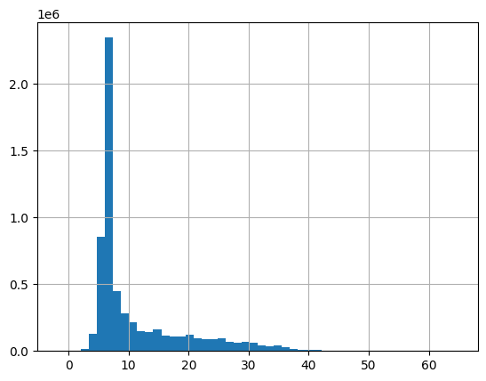
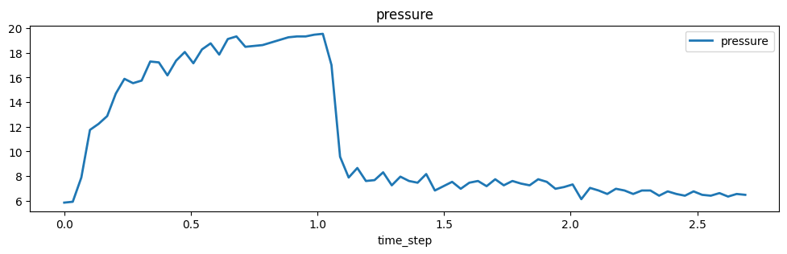
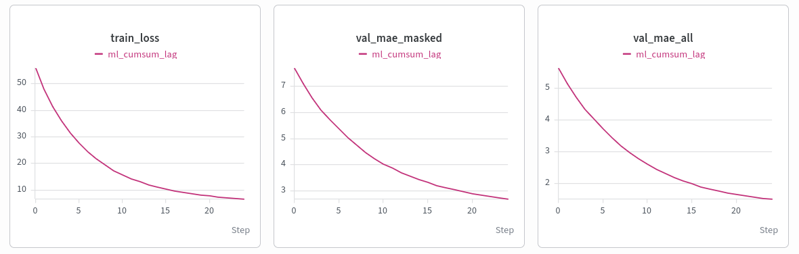
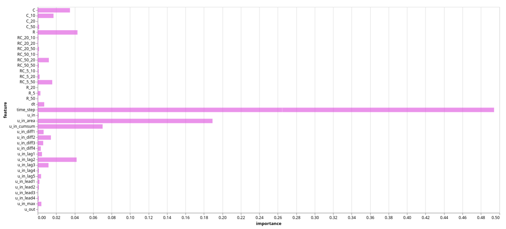
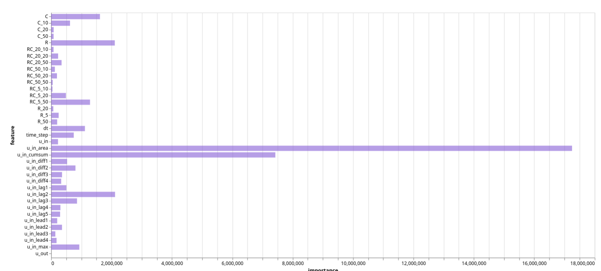
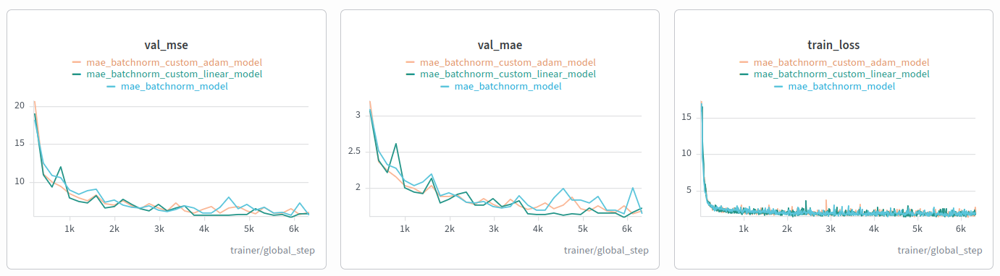
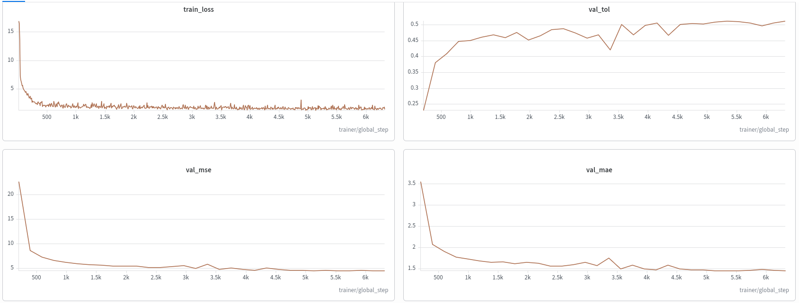
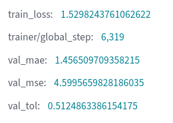

# Google Brain Ventilator Pressure Prediction

**Author:** Bohdan Onyshchenko &nbsp;|&nbsp; **Task:** [Ventilator Pressure Prediction](https://www.kaggle.com/competitions/ventilator-pressure-prediction) &nbsp;|&nbsp; **Code:** `main.ipynb`, `eda.ipynb` &nbsp;|&nbsp; **Experiment logs:** [Weights & Biases project](https://forge.coreweave.com/wandb/bhnyshchenko-kyiv-school-of-economics/google_brain?nw=nwuserbhnyshchenko)

---

## 1. Problem and approach

A mechanical ventilator pushes air into a patient's lung. Each *breath* is a time series of 80 steps. The inputs are the lung properties `R` (airway resistance) and `C` (lung compliance), the inhale valve command `u_in`, the exhale valve flag `u_out`, and the time stamp. The target is the airway pressure at every step. This is a regression problem on tabular, sequential data: 6,036,000 training rows (75,450 breaths) and 4,024,000 test rows (50,300 breaths).

The pipeline has five blocks in `main.ipynb`:

1. **Setup and data:** loading, feature engineering, validation split.
2. **ML block:** gradient boosting.
3. **DL block:** a PyTorch Lightning MLP trained on grouped breaths. A custom linear layer and a custom AdamW optimizer were implemented and tested.
4. **LightGBM block.**
5. **Ensemble:** a two-stage stacking model trained on the validation breaths.

The blocks communicate only through six arrays: `ml_val_pred`, `ml_test_pred`, `dl_val_pred`, `dl_test_pred`, `lgb_val_pred` and `lgb_test_pred`, each aligned row by row with the sorted `df_val` / `df_test`.

---

## 2. Data insights (EDA)

The EDA lives in `eda.ipynb`, since it is not part of the training pipeline.

- **Clean data check** No null values and no duplicate rows in train or test.
- **Fixed structure.** Every breath has exactly 80 rows. That means the table can be reshaped into `[breaths, 80, features]`.
- **Lung types.** `R` takes the values {5, 20, 50} and `C` the values {10, 20, 50}, so there are 9 lung types. The crosstab of `R` and `C` shows similar proportions in train and test, which supports stratifying by `(R, C)`.
- **Target.** Pressure ranges from about -1.9 to 64.8 cmH₂O with a mean of 11.2 and a standard deviation of 8.1.
- **Two phases per breath.** `u_out` is 0 during inhale and 1 during exhale. Its mean is 0.62, so about 38% of rows are inhale rows. This matters for the metric (section 3).
- **Physics.** Pressure follows the total air that has flowed in so far, not just the current flow. A per-row model cannot see that, and this motivated the feature engineering in section 5.

**Adversarial validation.** A logistic regression was trained to distinguish train rows from test rows. Its ROC-AUC was **0.5**, meaning train and test look alike on the raw features, so a random split by breath is a reasonable proxy for the test set.

---

## 3. Target metric analysis

The official metric is **MAE**, computed **only on inhale rows (`u_out == 0`)**.

$$MAE = \frac{1}{n} \sum_{i=1}^{n} |y_i - \hat{y}_i|$$
It is easy to understand, implement and from what internet says it tends to optimize the model to median solution. But it has it's weaknesses: the error increases linearly, which means that extreme outliers are weighted the same as small errors.

I propose two metrics as an alternative :
1. MSE - it is an industry standart metric that penaltizes outliers rather than small mistakes. It can be used as a loss function for optimization and I will try to train two models for both MAE and MSE and then compare their performance.
    $$MSE = \frac{1}{n} \sum_{i=1}^{n} (y_i - \hat{y}_i)^2$$
2. Tolerance accuracy - it is here only because I thought it would be interesting to see what fraction of time our modelpredicts the preassure in some threshold near the actual value, and then I found out there is a metric for that. I will use it mostly to get some insights during validation.
    $$\text{Tolerance Accuracy} = \frac{1}{n} \sum_{i=1}^{n} \mathbb{I}\left(|y_i - \hat{y}_i| \le \epsilon\right)$$

---

## 4. Validation strategy

- **Split by breath** A breath is one physical process, and rows within it are strongly correlated. Splitting rows would leak neighbouring steps into validation and make scores look better than they are.
- **Stratified by `(R, C)`** so that all 9 lung types appear in the same proportion in both parts.
- **67 / 33 split, fixed `random_state`** Both blocks and the ensemble use the same validation breaths, so their scores are comparable and the ensemble can be trained on honest predictions.
- **Expected correlation with the leaderboard:** high, because the test set has the same lung types (see the crosstab) and adversarial AUC is 0.5. 
- All validation metrics and losses are **masked** (`u_out == 0`).

---

## 5. Feature engineering

Per-breath features (computed with `groupby("breath_id")`, so nothing leaks across breaths):

| Feature | Meaning |
|---|---|
| `u_in_lag1` … `u_in_lag5` | `u_in` one to five steps ago (0 at the start of a breath) |
| `u_in_cumsum` | running total of `u_in` in the breath (proportional to the air volume in the lung) |
| `dt` | time since the previous step |
| `u_in_area` | running sum of `u_in × dt` |
| `u_in_max` | maximum `u_in` in the breath |
| `u_in_lead1` … `u_in_lead4` | `u_in` one to four steps ahead (0 at the end of a breath) |
| `u_in_diff1` … `u_in_diff4` | `u_in` minus its value one to four steps back |
| one-hot `R`, `C`, `R_C` | 15 columns for the lung type |

**Quick check in `eda.ipynb`.**
(`HistGradientBoostingRegressor`), same split, only the feature set changes:

| Feature set | Masked MAE |
|---|---|
| base (5 features) | `4.156` |
| base + 5 lags | `2.483` |
| base + cumsum | `1.986` |
| base + 5 lags + cumsum | `1.521` |

The result's are obvious, lag and cumsum feateres are necesary for training a good model.

---

## 6. Machine learning models

### 6.1 Gradient boosting

**Model:** scikit-learn gradient boosting on row-level features, 100 trees, learning rate 0.1, depth 4. The first two runs use `GradientBoostingRegressor`. The final run uses `HistGradientBoostingRegressor`, which trains faster. Validation curves, per-stage masked MAE and feature importance are logged to W&B.

| Run | Features | Masked MAE | Masked MSE | Tol@1 |
|---|---|---|---|---|
| `gbr_baseline` | 5 base | 4.449 | 39.85 | 0.193 |
| `gbr_lags_cumsum` | 11 | 2.696 | 14.23 | 0.270 |
| `ml_new_feature_eng` | 37 | 1.797 | 6.045 | 0.409 |

**Kaggle:** 11 features: public 2.7116 / private 2.6938 (local val 2.696). 37 features: public 1.8018 / private 1.7951 (local val 1.797).

### 6.2 LightGBM

LightGBM on the 37 features. Huber loss (alpha 1.0), 96 leaves, learning rate 0.2, up to 3000 trees with early stopping, trained on inhale rows only. It was trained in a separate Colab session, and the notebook loads its saved predictions.

| Run | Masked MAE | Masked MSE | Tol@1 |
|---|---|---|---|
| `lgbm_new_feature_eng` | 0.595 | 0.903 | 0.828 |

**Kaggle:** public 0.5960 / private 0.5998.

---

## 7. Deep learning model

### 7.1 Architecture
`PressureMLP`: an input `BatchNorm1d` over the feature dimension, then a stack of `Linear → ReLU` layers `n_features → 16 → 32 → 64 → 128 → 32 → 1` (about 15.8 K parameters). `nn.Linear` acts on the last dimension, so the network accepts `[B, 80, F]`, but it still treats every time step separately. The memory of previous steps comes only from the lag and cumsum features.

**Batch normalization instead of preprocessing scaling.** `u_in_cumsum` reaches hundreds, while `time_step` is below 3. I used batch normalization as the input layer to fix the scale problem. In evaluation mode it uses running statistics, so test predictions do not depend on batch composition.

### 7.2 Custom layer (`nn.Module` with `nn.Parameter`)
A re-implementation of `nn.Linear` (`MyLittleLayerFriendshipIsMagic`): a weight `[out, in]` with He initialization (`N(0, 2/in)`, matching the ReLU that follows), a zero-initialized bias, and `forward(x) = x @ Wᵀ + b`. During testing the performance remains almost equal to native Pytorch implementation but the training time grows.

### 7.3 Custom optimizer (`torch.optim.Optimizer`)
A re-implementation of **AdamW** (`TheAmazingWorldOfOptimizer`). Per step, for each parameter it follows the same algorithm as AdamW. The result's again were on the same metric level with native implementaiton, but the time for training increased.

### 7.4 Training setup
- **Loss:** L1 (MAE), masked to the inhale rows. **Optimizer:** AdamW, lr 1e-3, weight decay 0.01, with cosine annealing of the learning rate down to 1e-5.
- **Training:** 16 epochs, batch size 128, validation twice per epoch.

| Run | Change vs. previous | Masked MAE | Masked MSE | Tol@1 |
|---|---|---|---|---|
| `mlp_mae_baseline` | 5 features, batch norm | 4.483 | 50.77 | 0.271 |
| `mlp_lags_cumsum` | + lags + cumsum | 1.646 | 5.669 | 0.475 |
| `mlp_custom_layer` | + custom linear layers | 1.729 | 5.872 | 0.427 |
| `mlp_custom_adamw` | + custom optimizer | 1.688 | 6.065 | 0.471 |
| `mae_new_feature_eng` | 37 features, cosine lr | 1.457 | 4.600 | 0.512 |

**Kaggle (last run):** public 1.4632 / private 1.4515.

---

## 8. Ensemble (two-stage pipeline)

- **Stage 1:** the ML, DL and LightGBM models, trained on the training split.
- **Stage 2:** a `HistGradientBoostingRegressor` (`loss="absolute_error"`, 100 iterations) trained on the **validation** breaths. Inputs: the three stage-1 predictions plus `R`, `C`, `u_out` and `time_step`. Training on validation is legitimate because stage 1 never saw those breaths.
- **Validation:** the second stage is scored with **5-fold `GroupKFold` grouped by `breath_id`**, so whole breaths are held out. The out-of-fold predictions give the ensemble score. The final stacker is then fitted on all validation breaths and applied to the test predictions.
- **Baselines for comparison:** simple mean of the three models, and a weighted average with the weights (ml, dl, lgb) searched on a 0.05 grid.

| Model | Validation masked MAE | Masked MSE | Tol@1 | Kaggle public | Kaggle private |
|---|---|---|---|---|---|
| ML | 1.797 | 6.045 | 0.409 | 1.8018 | 1.7951 |
| DL | 1.457 | 4.600 | 0.512 | 1.4632 | 1.4515 |
| LightGBM | 0.595 | 0.903 | 0.828 | 0.5960 | 0.5998 |
| Mean of the three | 1.109 | 2.541 | 0.599 | - | - |
| Weighted average (weights ml / dl / lgb = 0 / 0 / 1) | 0.595 | 0.903 | 0.828 | - | - |
| Stacking (5-fold OOF) | 0.656 | 1.206 | 0.807 | 0.6623 | 0.6623 |

Per-fold masked MAE of the stacker: 0.658, 0.661, 0.654, 0.661, 0.646.

---

## 9. Conclusions

- The lag and cumsum features lowered the error of both models (ML 4.449 → 2.696, DL 4.483 → 1.646).
- With the full 37 features the validation masked MAE is 1.797 for ML, 1.457 for DL and 0.595 for LightGBM.
- Validation and Kaggle scores are close for every model, for example LightGBM 0.595 on validation and 0.5998 on the private leaderboard.

---

## 10. Reproducing the results

1. `pip install pytorch_lightning wandb kagglehub python-dotenv scikit-learn lightgbm`
2. Put `KAGGLE_USERNAME`/`KAGGLE_KEY` and `WANDB_API_KEY` in a `.env` file.
3. Run `main.ipynb` from top to bottom (restart the kernel first).
4. Submissions are written as `ml_submission.csv`, `dl_submission.csv`, `lgb_submission.csv` and `ensamble_submission.csv`.
